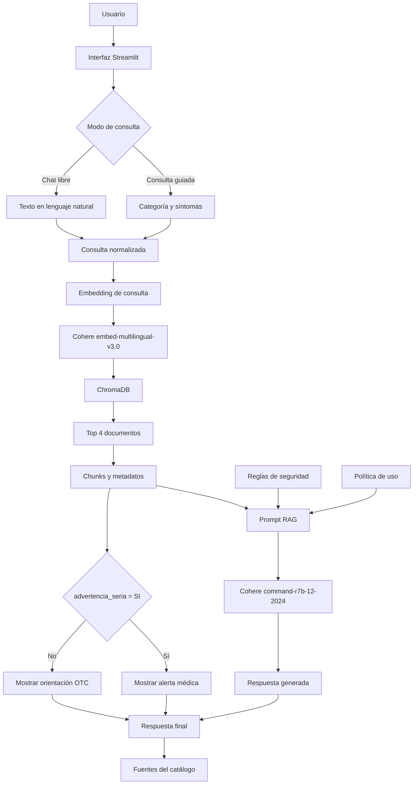

<div align="center">


### Asistente inteligente para orientación sobre medicamentos de venta libre en México

<p>
FarmaKnow combina búsqueda semántica, generación aumentada por recuperación y reglas de seguridad para consultar un catálogo curado de medicamentos OTC, productos herbolarios, vitaminas y suplementos.
</p>

[](https://www.python.org/)
[](https://streamlit.io/)
[](https://cohere.com/)
[](https://www.trychroma.com/)
[](https://aws.amazon.com/ec2/)

<br>

[](http://18.206.184.187:8501)
[](https://github.com/jgodinezaviles/farmaknow)
[](https://github.com/jgodinezaviles/farmaknow/issues)

<br>

Proyecto desarrollado para el challenge **Alura Agente** del programa
**Oracle Next Education, ONE**.

</div>

---

## Contenido

* [Descripción](#descripción)
* [Demostración](#demostración)
* [Funciones principales](#funciones-principales)
* [Resumen técnico](#resumen-técnico)
* [Arquitectura](#arquitectura)
* [Seguridad y alcance](#seguridad-y-alcance)
* [Catálogo de conocimiento](#catálogo-de-conocimiento)
* [Tecnologías](#tecnologías)
* [Instalación local](#instalación-local)
* [Pruebas y utilidades](#pruebas-y-utilidades)
* [Estructura del repositorio](#estructura-del-repositorio)
* [Despliegue](#despliegue)
* [Ejemplos de comportamiento](#ejemplos-de-comportamiento)
* [Limitaciones actuales](#limitaciones-actuales)
* [Mejoras futuras](#mejoras-futuras)
* [Política de uso](#política-de-uso)
* [Autor](#autor)

---

## Descripción

**FarmaKnow** es un agente de inteligencia artificial diseñado para orientar sobre medicamentos de venta libre, también conocidos como **OTC**, productos herbolarios, vitaminas y suplementos disponibles en México.

La aplicación permite consultar el catálogo de dos maneras:

1. **Consulta guiada:** el usuario selecciona una categoría y uno o varios síntomas.
2. **Chat libre:** el usuario describe su malestar utilizando sus propias palabras.

La consulta se convierte en un embedding multilingüe y se compara con una base vectorial local. Después, los fragmentos más relevantes del catálogo se incorporan al prompt enviado al modelo generativo.

La respuesta se construye únicamente con el contexto recuperado y puede incluir:

* Nombre comercial.
* Principio activo.
* Presentación.
* Clasificación de venta.
* Contraindicaciones relevantes.
* Advertencias de seguridad.
* Productos del catálogo utilizados como fuente.

> [!IMPORTANT]
> FarmaKnow es un proyecto educativo. No diagnostica enfermedades, no prescribe tratamientos y no sustituye una consulta con un médico, farmacéutico o profesional de la salud.

---

## Demostración

La aplicación está disponible públicamente en:

### [Abrir FarmaKnow](http://18.206.184.187:8501)

<div align="center">


</div>

> [!NOTE]
> La demostración actual utiliza una dirección IP y una conexión HTTP sobre el puerto `8501`. El navegador puede mostrarla como una conexión no segura.

---

## Funciones principales

| Función                    | Descripción                                                                                                      |
| -------------------------- | ---------------------------------------------------------------------------------------------------------------- |
| **Consulta guiada**        | Organiza los síntomas en cinco grupos y permite seleccionar varios mediante controles visuales.                  |
| **Chat libre**             | Permite escribir una consulta en lenguaje natural y conserva el historial durante la sesión actual de Streamlit. |
| **Búsqueda semántica**     | Recupera registros relacionados aunque la consulta no coincida de forma literal con el texto del catálogo.       |
| **RAG**                    | Envía al modelo únicamente los fragmentos recuperados junto con reglas de respuesta y seguridad.                 |
| **Detección de alertas**   | Revisa el campo `advertencia_seria` de los resultados recuperados.                                               |
| **Fuentes visibles**       | Presenta los nombres de los productos del catálogo utilizados para responder.                                    |
| **Control de alcance**     | Indica cuando la información solicitada no se encuentra dentro del catálogo.                                     |
| **Interfaz personalizada** | Utiliza Streamlit, tema oscuro, navegación mediante imágenes y estilos CSS propios.                              |

### Modos de consulta

<table>
<tr>
<td align="center" width="33%">
<br>
<strong>Consulta guiada</strong><br>
Selección de categoría y síntomas.
</td>
<td align="center" width="33%">
<br>
<strong>Chat libre</strong><br>
Consulta escrita en lenguaje natural.
</td>
<td align="center" width="33%">
<br>
<strong>Acerca de</strong><br>
Información sobre alcance y tecnología.
</td>
</tr>
</table>

---

## Resumen técnico

| Elemento                            | Implementación actual     |
| ----------------------------------- | ------------------------- |
| Registros del catálogo              | `161`                     |
| Documentos en la base vectorial     | `162`                     |
| Grupos de síntomas                  | `5`                       |
| Colección de ChromaDB               | `medicamentos_otc`        |
| Resultados recuperados por consulta | `Top 4`                   |
| Modelo de embeddings                | `embed-multilingual-v3.0` |
| Modelo generativo                   | `command-r7b-12-2024`     |
| Temperatura del modelo              | `0.3`                     |
| Interfaz                            | Streamlit                 |
| Persistencia vectorial              | ChromaDB local            |
| Despliegue actual                   | AWS EC2                   |

Los **162 documentos vectorizados** corresponden a:

* 161 registros del catálogo.
* 1 documento con la política de uso y alcance.

---

## Arquitectura



### Flujo de recuperación

```text
Consulta del usuario
        │
        ▼
Embedding con Cohere
        │
        ▼
Consulta semántica en ChromaDB
        │
        ▼
Recuperación de los 4 resultados más cercanos
        │
        ▼
Contexto + metadatos + reglas de seguridad
        │
        ▼
Generación de respuesta con Cohere
        │
        ▼
Respuesta + alerta + fuentes consultadas
```

### Indexación

Durante la indexación, cada fila del CSV se transforma en un texto narrativo que contiene:

```text
Síntoma
Categoría
Nombre comercial
Principio activo
Presentación
Clasificación de venta
Contraindicaciones
Nivel de alerta
Fuente
```

Los documentos se convierten en embeddings con:

```python
model="embed-multilingual-v3.0"
input_type="search_document"
```

Las consultas utilizan el mismo modelo, pero con:

```python
input_type="search_query"
```

---

## Seguridad y alcance

FarmaKnow incluye reglas explícitas dentro del prompt del sistema para reducir respuestas fuera de alcance o potencialmente peligrosas.

### El agente debe

* Responder únicamente con la información recuperada del catálogo.
* Mantener un tono breve, claro y empático.
* Mencionar nombre comercial, principio activo, presentación y contraindicaciones cuando sugiera un producto.
* Recomendar consultar a un profesional de la salud.
* Informar cuando no encuentre datos relevantes en el catálogo.
* Priorizar una alerta médica cuando los resultados recuperados contienen `advertencia_seria: SI`.

### El agente no debe

* Diagnosticar enfermedades.
* Recomendar medicamentos que requieren receta.
* Inventar productos o información ausente del catálogo.
* Indicar dosis, cantidades o frecuencias específicas.
* Sustituir la valoración de un profesional.
* Evaluar de forma completa interacciones entre varios medicamentos.
* Presentar un producto como solución principal ante un posible síntoma de emergencia.

### Detección de alertas

La implementación actual revisa los metadatos de los cuatro documentos recuperados:

```python
hay_alerta = any(
    metadata.get("advertencia_seria") == "SI"
    for metadata in metadatas
)
```

Cuando se detecta una alerta, la interfaz muestra un mensaje destacado recomendando atención médica inmediata.

Algunos ejemplos de situaciones marcadas en el catálogo son:

* Dolor de pecho.
* Dificultad para respirar.
* Tos con sangre.
* Sangrado gastrointestinal.
* Desmayo o confusión.
* Dolor súbito e intenso.
* Fiebre alta persistente.
* Signos de deshidratación severa.

> [!WARNING]
> En una emergencia real se debe contactar a los servicios de emergencia o acudir inmediatamente a una unidad médica. No se debe depender de FarmaKnow para tomar decisiones urgentes.

> [!CAUTION]
> Las consultas se envían a Cohere para generar embeddings y respuestas. No introduzcas nombres completos, direcciones, expedientes clínicos ni otros datos personales sensibles.

---

## Catálogo de conocimiento

El catálogo principal se encuentra en:

```text
docs/catalogo_unificado.csv
```

Contiene las siguientes columnas:

```text
grupo
categoria_normalizada
sintoma
categoria
principio_activo
nombre_comercial
presentacion
clasificacion_venta
contraindicaciones_clave
advertencia_seria
fuente
```

### Grupos incluidos

| Identificador interno      | Nombre mostrado en la interfaz |
| -------------------------- | ------------------------------ |
| `dolor_fiebre_inflamacion` | Dolor y fiebre                 |
| `respiratorio_gripe`       | Gripe y alergias               |
| `digestivo`                | Digestivo                      |
| `dermatologico_topico`     | Piel                           |
| `herbolaria_vitaminas`     | Herbolaria y vitaminas         |

### Fuentes citadas en los registros

Los registros del catálogo incluyen referencias como:

* COFEPRIS.
* PLM.
* Cuadro Básico y Catálogo de Medicamentos.
* Consejo de Salubridad General.
* Farmacopea Herbolaria de los Estados Unidos Mexicanos.
* Información de fabricantes y distribuidores.
* Etiquetado comercial y referencias farmacológicas.

> [!NOTE]
> FarmaKnow no consulta fuentes médicas en tiempo real. Trabaja con el catálogo estático incluido en el repositorio y con la política de uso indexada.

---

## Tecnologías

| Tecnología     | Uso                                                                   |
| -------------- | --------------------------------------------------------------------- |
| **Python**     | Lógica del agente, procesamiento de datos e integración de servicios. |
| **Streamlit**  | Interfaz web, navegación, chat y selección guiada.                    |
| **Cohere**     | Embeddings multilingües y generación de respuestas.                   |
| **ChromaDB**   | Almacenamiento persistente y recuperación semántica.                  |
| **Pandas**     | Lectura y transformación del catálogo CSV.                            |
| **HTML y CSS** | Personalización visual de la interfaz de Streamlit.                   |
| **AWS EC2**    | Alojamiento de la demostración pública.                               |
| **GitHub**     | Control de versiones y documentación.                                 |

### Dependencias del proyecto

El archivo `requirements.txt` contiene:

```text
streamlit
cohere
chromadb
pandas
```

---

## Instalación local

### Requisitos

* Python 3.10 o superior recomendado.
* Git.
* `pip`.
* Una API key de Cohere.
* Conexión a internet para utilizar la API de Cohere.

### 1. Clonar el repositorio

```bash
git clone https://github.com/jgodinezaviles/farmaknow.git
cd farmaknow
```

### 2. Crear un entorno virtual

#### Windows PowerShell

```powershell
python -m venv venv
.\venv\Scripts\Activate.ps1
```

#### Windows CMD

```bat
python -m venv venv
venv\Scripts\activate.bat
```

#### Linux o macOS

```bash
python3 -m venv venv
source venv/bin/activate
```

### 3. Instalar las dependencias

```bash
python -m pip install --upgrade pip
pip install -r requirements.txt
```

### 4. Configurar la API key de Cohere

#### Windows PowerShell, sesión actual

```powershell
$env:COHERE_API_KEY="tu_api_key"
```

#### Windows, variable persistente

```bat
setx COHERE_API_KEY "tu_api_key"
```

Después de utilizar `setx`, abre una nueva terminal.

#### Linux o macOS

```bash
export COHERE_API_KEY="tu_api_key"
```

Puedes comprobar que la variable existe con:

#### PowerShell

```powershell
echo $env:COHERE_API_KEY
```

#### Linux o macOS

```bash
echo $COHERE_API_KEY
```

> [!CAUTION]
> Nunca subas tu API key a GitHub. El repositorio ya ignora `.env` y `.streamlit/secrets.toml`, pero el código actual obtiene la clave directamente desde la variable de entorno `COHERE_API_KEY`.

### 5. Ejecutar la aplicación

```bash
python -m streamlit run app.py
```

Streamlit abrirá la aplicación normalmente en:

```text
http://localhost:8501
```

---

## Pruebas y utilidades

### Regenerar la base vectorial

El repositorio ya incluye la base de ChromaDB. Solo necesitas regenerarla cuando modifiques el catálogo o la política de uso.

```bash
python src/indexar_catalogo.py
```

El script:

1. Lee `docs/catalogo_unificado.csv`.
2. Convierte cada fila en un documento narrativo.
3. Agrega `docs/politica_uso_alcance.md`.
4. Genera embeddings con Cohere.
5. Elimina la colección anterior si existe.
6. Crea nuevamente la colección `medicamentos_otc`.
7. Guarda la base en `chroma_db/`.

> [!WARNING]
> Regenerar la base elimina y vuelve a crear la colección local. También consume solicitudes de la API de Cohere.

### Probar la búsqueda semántica

```bash
python src/probar_busqueda.py
```

Este archivo realiza una consulta de prueba, recupera tres resultados y muestra sus documentos y metadatos en la terminal.

### Ejecutar la versión de consola

```bash
python src/agente.py
```

`agente.py` contiene una versión de prueba por terminal. La interfaz web principal importa y utiliza `src/rag.py`.

---

## Estructura del repositorio

```text
farmaknow/
│
├── .streamlit/
│   └── config.toml
│
├── assets/
│   ├── acercade.png
│   ├── chatlibre.png
│   ├── consultaguiada.png
│   ├── farmaknow.png
│   └── home.png
│
├── chroma_db/
│   ├── 9a01e07e-aa84-46b7-bf87-f3efbf445b03/
│   └── chroma.sqlite3
│
├── docs/
│   ├── captura_deploy.png
│   ├── catalogo_unificado.csv
│   ├── digestivo.txt
│   ├── dolor_fiebre_inflamacion.txt
│   ├── gripe_resfriadocomun_tos.txt
│   ├── herbolaria.txt
│   ├── politica_uso_alcance.md
│   └── topico_dermatologico.txt
│
├── src/
│   ├── agente.py
│   ├── indexar_catalogo.py
│   ├── probar_busqueda.py
│   └── rag.py
│
├── .gitignore
├── app.py
├── README.md
└── requirements.txt
```

### Archivos principales

| Archivo                        | Función                                                                                               |
| ------------------------------ | ----------------------------------------------------------------------------------------------------- |
| `app.py`                       | Interfaz completa de Streamlit, navegación, consulta guiada, chat libre y presentación de resultados. |
| `src/rag.py`                   | Recuperación semántica, prompt de seguridad, llamada al modelo y detección de alertas.                |
| `src/indexar_catalogo.py`      | Construcción y regeneración de la base vectorial.                                                     |
| `src/probar_busqueda.py`       | Prueba directa de recuperación semántica.                                                             |
| `src/agente.py`                | Variante del agente para uso y pruebas desde terminal.                                                |
| `docs/catalogo_unificado.csv`  | Fuente estructurada principal del catálogo.                                                           |
| `docs/politica_uso_alcance.md` | Reglas y limitaciones que también se agregan a la base vectorial.                                     |
| `.streamlit/config.toml`       | Tema oscuro de la aplicación.                                                                         |
| `assets/`                      | Logotipo, botón de inicio e iconos de navegación.                                                     |

Los archivos `.txt` de `docs/` funcionan como material de apoyo y organización del contenido. La indexación actual utiliza directamente el CSV unificado y el documento de política.

---

## Despliegue

La demostración está alojada en una instancia **AWS EC2**.

| Componente        | Configuración actual                 |
| ----------------- | ------------------------------------ |
| Proveedor         | Amazon Web Services                  |
| Servicio          | EC2                                  |
| Instancia         | `t3.micro`                           |
| Sistema operativo | Amazon Linux 2023                    |
| Aplicación        | Streamlit                            |
| Puerto público    | `8501`                               |
| Base vectorial    | ChromaDB persistente en la instancia |
| API externa       | Cohere                               |

Los Security Groups permiten el acceso necesario para administración y ejecución de la aplicación, incluyendo el puerto de Streamlit.

### URL pública

```text
http://18.206.184.187:8501
```

---

## Ejemplos de preguntas y respuestas

### Consulta sobre ardor estomacal

> **Pregunta:** "me arde el estomago despues de comer"

**Respuesta:**

Entiendo que tienes ardor estomacal después de comer. En este caso, te sugiero que consideres usar Riopan. Este medicamento contiene magaldrato y dimeticona, y está disponible en gel oral en sobres. Sin embargo, es importante que sigas las instrucciones del empaque y que consultes a un profesional de la salud si los síntomas persisten o empeoran.

Recuerda que es fundamental no automedicarse y buscar siempre la orientación de un médico o farmacéutico cuando se trata de la salud.

---

### Consulta sobre dolor de pecho

> **Pregunta:** "tengo dolor de pecho"

**Respuesta:**

El dolor de pecho puede ser un síntoma preocupante y, en algunos casos, puede indicar una condición médica grave. Es importante no automedicarse y buscar atención médica inmediata si el dolor persiste o empeora.

Basándome en el contexto proporcionado, te sugiero que consideres las siguientes opciones:

**Aspirina Bayer:** Este medicamento contiene ácido acetilsalicílico y se utiliza para aliviar el dolor de cabeza y reducir la inflamación. Sin embargo, es importante tener en cuenta que la Aspirina no es recomendada para el dolor de pecho, ya que puede aumentar el riesgo de sangrado y no es adecuada para este tipo de síntomas.

**Gaviscon Suspensión:** Este medicamento contiene alginato de sodio, bicarbonato de sodio y carbonato de calcio, y se utiliza para aliviar la acidez y el dolor de pecho asociado con el reflujo gastroesofágico. Sin embargo, es importante tener en cuenta que el dolor de pecho puede ser un síntoma de una condición médica grave, como un ataque cardíaco, y no debe ser ignorado.

Si tienes dolor de pecho, te recomiendo que consultes a un profesional de la salud lo antes posible. Es importante no automedicarse y buscar atención médica inmediata si el dolor persiste o empeora.

---

### Consulta fuera del catálogo

> **Pregunta:** "cual es la capital de Francia"

**Respuesta:**

No encontre informacion sobre esto en el catalogo disponible.

Recomiendo consultar a un profesional de la salud para obtener una respuesta precisa sobre la capital de Francia.

---

## Limitaciones actuales

* El catálogo es estático y debe actualizarse manualmente.
* La aplicación no consulta registros sanitarios ni disponibilidad de productos en tiempo real.
* No verifica la edad, peso, embarazo, enfermedades previas o medicamentos actuales del usuario.
* No realiza una evaluación clínica ni una revisión completa de interacciones.
* La recuperación utiliza los cuatro resultados más cercanos sin una etapa adicional de reranking.
* La alerta se activa cuando cualquiera de los resultados recuperados contiene `advertencia_seria: SI`.
* Un resultado de alerta semánticamente cercano, pero no exactamente aplicable, podría producir una advertencia conservadora.
* El historial del chat vive únicamente en `st.session_state` y no se conserva de forma permanente.
* Las respuestas pueden variar porque son generadas por un modelo de lenguaje.
* La demostración pública actual utiliza HTTP y no cuenta con dominio personalizado.
* Las versiones de las dependencias no están fijadas en `requirements.txt`.

---

## Mejoras futuras

* Separar la detección de emergencias del mecanismo de recuperación semántica.
* Agregar un clasificador específico de síntomas de alerta.
* Incorporar umbrales mínimos de similitud y reranking.
* Crear pruebas unitarias y evaluaciones automáticas para consultas seguras y fuera de alcance.
* Fijar versiones de dependencias para mejorar la reproducibilidad.
* Añadir manejo de errores para la API, la variable de entorno y la base vectorial.
* Mejorar la visualización de fuentes y contraindicaciones.
* Agregar métricas de calidad de recuperación.
* Implementar HTTPS y un dominio personalizado.
* Optimizar la experiencia en dispositivos móviles.
* Incorporar una política de privacidad visible dentro de la interfaz.
* Agregar filtros opcionales de edad y condiciones especiales, sin convertir la herramienta en un sistema de diagnóstico.

---

## Política de uso

La política completa está disponible en:

[`docs/politica_uso_alcance.md`](docs/politica_uso_alcance.md)

FarmaKnow tiene fines educativos y demostrativos. La información generada no sustituye:

* Una consulta médica.
* Un diagnóstico profesional.
* Una receta.
* Un tratamiento indicado por personal de salud.
* La información oficial del empaque.
* La atención de los servicios de emergencia.

---

## Autor

<div align="center">

### Jorge Armando Godínez Avilés

Proyecto desarrollado como parte de **Oracle Next Education, ONE**, en colaboración con **Alura Latam**.

[](https://github.com/jgodinezaviles)

</div>

---

<div align="center">


### Información responsable, respuestas fundamentadas y seguridad antes que automedicación.

Si el proyecto te resulta interesante, puedes marcar el repositorio con una estrella.

</div>
