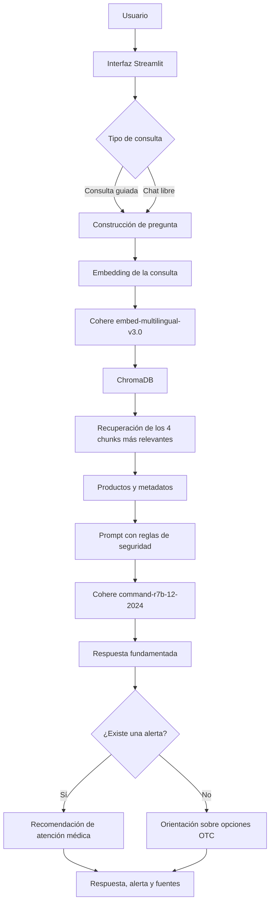
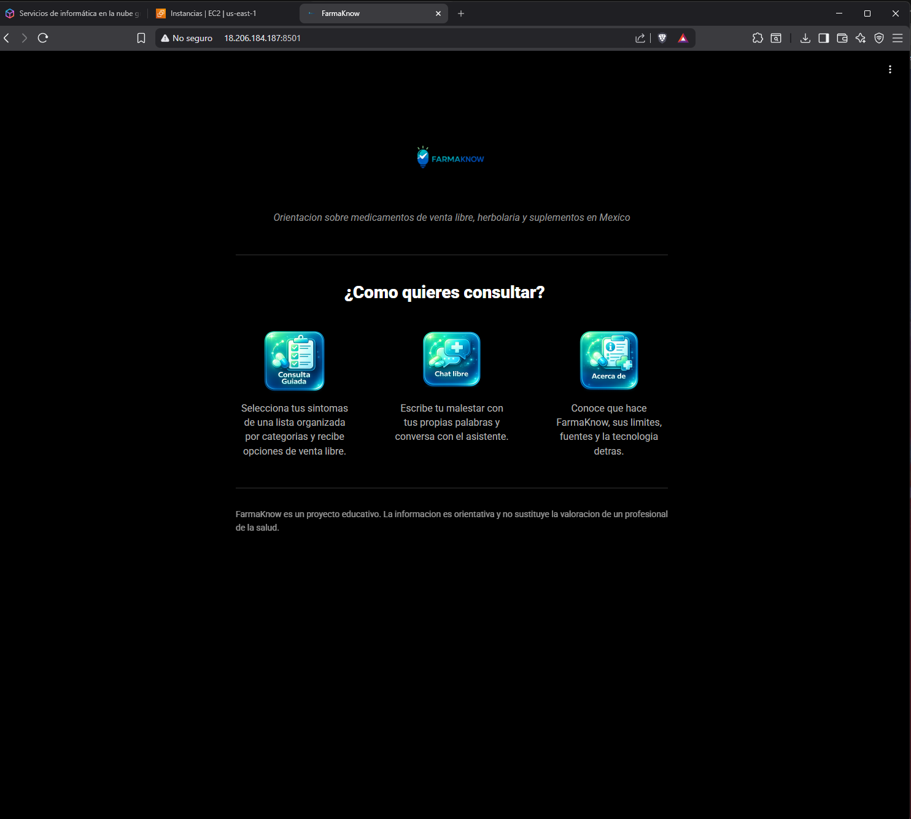

<div align="center">


# 💊 FarmaKnow

### Asistente inteligente para la orientación sobre medicamentos de venta libre en México

[](https://www.python.org/)
[](https://streamlit.io/)
[](https://cohere.com/)
[](https://www.trychroma.com/)
[](https://aws.amazon.com/ec2/)

Proyecto desarrollado para el challenge **Alura Agente** del programa
**Oracle Next Education, ONE**.

[Ver demostración](http://18.206.184.187:8501) · [Reportar un problema](https://github.com/jgodinezaviles/farmaknow/issues)

</div>

---

## 📑 Contenido

* [Descripción](#-descripción)
* [Características principales](#-características-principales)
* [Seguridad y alcance](#-seguridad-y-alcance)
* [Arquitectura](#-arquitectura)
* [Tecnologías](#-tecnologías)
* [Catálogo de conocimiento](#-catálogo-de-conocimiento)
* [Instalación local](#-instalación-local)
* [Ejemplos de uso](#-ejemplos-de-uso)
* [Despliegue](#-despliegue)
* [Estructura del proyecto](#-estructura-del-proyecto)
* [Política de uso](#-política-de-uso)

---

## 🔎 Descripción

**FarmaKnow** es un agente de inteligencia artificial basado en una arquitectura **RAG**, Retrieval-Augmented Generation, diseñado para orientar a las personas sobre opciones de venta libre relacionadas con síntomas comunes.

El usuario puede describir su malestar mediante una consulta guiada o escribiendo libremente. El sistema analiza la solicitud, busca información relevante dentro de un catálogo curado y genera una respuesta basada exclusivamente en los registros recuperados.

El catálogo contiene **161 registros** de:

* Medicamentos de venta libre, OTC.
* Productos de herbolaria.
* Vitaminas.
* Suplementos alimenticios.

Cada respuesta puede incluir:

* Nombre comercial.
* Principio activo.
* Presentación.
* Contraindicaciones relevantes.
* Advertencias de seguridad.
* Recomendación de consulta profesional.

> [!IMPORTANT]
> FarmaKnow es un proyecto educativo y no sustituye el diagnóstico, tratamiento ni valoración de un médico o profesional de la salud.

---

## ✨ Características principales

| Función                     | Descripción                                                                                           |
| --------------------------- | ----------------------------------------------------------------------------------------------------- |
| 🧭 Consulta guiada          | Permite seleccionar síntomas mediante una interfaz estructurada.                                      |
| 💬 Chat libre               | Interpreta preguntas escritas en lenguaje natural.                                                    |
| 🧠 Búsqueda semántica       | Recupera información relacionada aunque la consulta no utilice exactamente las palabras del catálogo. |
| 📚 Respuestas fundamentadas | Genera respuestas utilizando únicamente el contenido recuperado.                                      |
| 🚨 Detección de alertas     | Identifica síntomas que podrían requerir atención médica inmediata.                                   |
| 🔗 Fuentes visibles         | Muestra los productos y registros utilizados para construir la respuesta.                             |
| 🛑 Control de alucinaciones | Indica cuando no existe información suficiente, en lugar de inventarla.                               |

---

## 🛡️ Seguridad y alcance

FarmaKnow fue diseñado con reglas específicas para reducir respuestas potencialmente peligrosas.

### El agente nunca debe

* Recomendar medicamentos de venta con receta.
* Proporcionar dosis específicas.
* Diagnosticar enfermedades.
* Sustituir la valoración de un profesional.
* Inventar productos o información ausente del catálogo.

### Detección de síntomas de alerta

Los registros pueden incluir el campo `advertencia_seria`.

Cuando la consulta contiene síntomas como:

* Dolor de pecho.
* Dificultad para respirar.
* Sangrado abundante.
* Pérdida del conocimiento.
* Reacción alérgica grave.
* Dolor intenso o repentino.

El agente debe priorizar la recomendación de **atención médica inmediata** y evitar sugerir productos de automedicación.

> [!WARNING]
> Ante una posible emergencia, se debe contactar a los servicios de emergencia o acudir inmediatamente a una unidad médica.

---

## 🏗️ Arquitectura



### Flujo de recuperación

```text
Consulta del usuario
        │
        ▼
Embedding multilingüe
        │
        ▼
Búsqueda semántica en ChromaDB
        │
        ▼
Top 4 fragmentos relevantes
        │
        ▼
Prompt con contexto y reglas de seguridad
        │
        ▼
Generación de respuesta con Cohere
        │
        ▼
Respuesta, bandera de alerta y fuentes
```

La base vectorial contiene **162 chunks**:

* 161 registros del catálogo.
* 1 documento con la política de uso y alcance.

---

## 🧰 Tecnologías

| Tecnología    | Uso dentro del proyecto                                |
| ------------- | ------------------------------------------------------ |
| **Python**    | Lógica principal del agente y procesamiento de datos.  |
| **Cohere**    | Generación de embeddings multilingües y respuestas.    |
| **ChromaDB**  | Almacenamiento y búsqueda dentro de la base vectorial. |
| **Pandas**    | Limpieza, validación y procesamiento del catálogo.     |
| **Streamlit** | Desarrollo de la interfaz web interactiva.             |
| **AWS EC2**   | Alojamiento de la aplicación en la nube.               |
| **GitHub**    | Control de versiones y documentación del proyecto.     |

---

## 📚 Catálogo de conocimiento

El catálogo fue construido utilizando información de referencia relacionada con productos de venta libre, herbolaria y suplementos disponibles en México.

Entre las fuentes consultadas se encuentran:

* COFEPRIS.
* PLM.
* Cuadro Básico y Catálogo de Medicamentos.
* Consejo de Salubridad General.
* NOM-086-SSA1.
* Farmacopea Herbolaria de los Estados Unidos Mexicanos.

Cada registro puede contener campos como:

```text
síntoma
categoría
principio activo
nombre comercial
presentación
clasificación de venta
contraindicaciones clave
advertencia seria
fuente
```

---

## ⚙️ Instalación local

### Requisitos

Antes de comenzar, asegúrate de contar con:

* Python 3.10 o superior.
* Git.
* Una API key de Cohere.
* `pip` actualizado.

### 1. Clonar el repositorio

```bash
git clone https://github.com/jgodinezaviles/farmaknow.git
cd farmaknow
```

### 2. Crear un entorno virtual

#### Windows

```bash
python -m venv venv
venv\Scripts\activate
```

#### Linux o macOS

```bash
python3 -m venv venv
source venv/bin/activate
```

### 3. Instalar las dependencias

```bash
pip install -r requirements.txt
```

### 4. Configurar la API key de Cohere

Obtén una API key desde el panel de Cohere.

#### Windows PowerShell

```powershell
setx COHERE_API_KEY "tu_api_key"
```

Después de ejecutar el comando, abre una nueva terminal.

#### Linux o macOS

```bash
export COHERE_API_KEY="tu_api_key"
```

También puedes utilizar un archivo `.env`:

```env
COHERE_API_KEY=tu_api_key
```

> [!CAUTION]
> Nunca publiques tu API key en GitHub. Agrega el archivo `.env` a tu `.gitignore`.

### 5. Regenerar la base vectorial

Este paso es opcional, ya que la base vectorial está incluida en el repositorio.

```bash
python src/indexar_catalogo.py
```

### 6. Ejecutar la aplicación

```bash
python -m streamlit run app.py
```

La aplicación estará disponible normalmente en:

```text
http://localhost:8501
```

---

## 💬 Ejemplos de uso

### Consulta relacionada con un síntoma común

**Pregunta**

```text
Me arde el estómago después de comer.
```

**Respuesta esperada**

```text
El ardor después de comer puede estar relacionado con acidez o reflujo.

Dentro del catálogo se encuentra Riopan, cuyo principio activo es
magaldrato con dimeticona y se presenta como gel oral en sobres.

Sigue las instrucciones indicadas en el empaque. Si el malestar es
intenso, frecuente, aparece acompañado de vómito, sangrado o dificultad
para tragar, consulta a un profesional de la salud.
```

---

### Consulta con un síntoma de alerta

**Pregunta**

```text
Tengo dolor de pecho.
```

**Respuesta esperada**

```text
El dolor de pecho puede ser una señal de una condición médica grave.

No es recomendable automedicarse ni intentar tratar este síntoma con
productos de venta libre. Busca atención médica inmediata, especialmente
si el dolor es intenso, repentino o está acompañado de dificultad para
respirar, sudoración, mareo, náuseas o dolor que se extiende al brazo,
espalda o mandíbula.
```

> [!IMPORTANT]
> Ante síntomas de alerta, FarmaKnow no debe presentar medicamentos como solución principal.

---

### Consulta fuera del catálogo

**Pregunta**

```text
¿Cuál es la capital de Francia?
```

**Respuesta esperada**

```text
No encontré información relacionada con esta consulta dentro del catálogo
de FarmaKnow.

Este asistente está limitado a orientación sobre medicamentos de venta
libre, herbolaria, vitaminas y suplementos.
```

---

## ☁️ Despliegue

La aplicación está desplegada en una instancia **AWS EC2**.

### Demostración pública

🔗 **http://18.206.184.187:8501**

### Infraestructura

| Servicio          | Configuración                               |
| ----------------- | ------------------------------------------- |
| Amazon EC2        | Instancia `t3.micro`.                       |
| Sistema operativo | Amazon Linux 2023.                          |
| Security Groups   | Reglas para SSH, HTTP, HTTPS y puerto 8501. |
| Aplicación        | Streamlit.                                  |

Oracle Next Education confirmó que el uso de **Oracle Cloud Infrastructure** era una sugerencia y no un requisito obligatorio, siempre que el proyecto estuviera disponible mediante una URL pública.

Se eligió AWS EC2 debido a la disponibilidad de recursos dentro de su capa gratuita al momento del despliegue.

### Evidencia del despliegue



---

## 📁 Estructura del proyecto

```text
farmaknow/
│
├── app.py
├── requirements.txt
├── README.md
│
├── data/
│   └── catalogo_medicamentos.csv
│
├── docs/
│   ├── logo.png
│   ├── captura_deploy.png
│   └── politica_uso_alcance.md
│
├── src/
│   ├── indexar_catalogo.py
│   ├── agente.py
│   ├── recuperacion.py
│   └── seguridad.py
│
└── chroma_db/
    └── ...
```

> La estructura puede variar de acuerdo con la versión actual del repositorio.

---

## 📜 Política de uso

La política completa de uso y alcance se encuentra en:

[`docs/politica_uso_alcance.md`](docs/politica_uso_alcance.md)

FarmaKnow tiene fines educativos y demostrativos. La información proporcionada es únicamente orientativa y no sustituye:

* Una consulta médica.
* Un diagnóstico profesional.
* Una receta.
* Un tratamiento indicado por personal de salud.
* La información oficial incluida en el empaque de cada producto.

---

## 🚧 Estado del proyecto

Actualmente, FarmaKnow se encuentra en fase de desarrollo y demostración académica.

Posibles mejoras futuras:

* Incorporar filtros por edad y condiciones especiales.
* Mejorar el sistema de clasificación de síntomas de alerta.
* Agregar pruebas automáticas para las reglas de seguridad.
* Implementar historial local de consultas.
* Añadir evaluación de calidad de recuperación.
* Mejorar la experiencia móvil.
* Implementar HTTPS y un dominio personalizado.

---

## 👨‍💻 Autor

**Jorge Armando Godínez Avilés**

Proyecto desarrollado como parte del programa **Oracle Next Education, ONE**, en colaboración con **Alura Latam**.

[](https://github.com/jgodinezaviles)

---

<div align="center">

### FarmaKnow

**Información responsable, respuestas fundamentadas y seguridad antes que automedicación.**

⭐ Si este proyecto te resulta interesante, puedes marcar el repositorio con una estrella.

</div>
